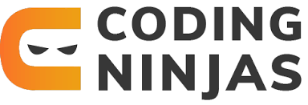

# [Coding Ninjas DSA Course Solutions](https://www.codingninjas.com/)

Welcome to the Coding Ninjas DSA Course Solutions repository! Here, you'll find meticulously crafted, optimized solutions to all the problems provided in the DSA course. From basic concepts like variables and loops to advanced data structures and algorithms like backtracking and dynamic programming, this repository aims to provide structured solutions to aid your learning journey.

Thank you for visiting this repository. All solutions provided here are curated to assist learners in understanding and overcoming challenges encountered during the course.

## Overview

This repository serves as a comprehensive resource hub for mastering data structures and algorithms with Coding Ninjas. From fundamental concepts to advanced topics, you'll find solutions organized in separate folders for easy navigation.

## What's Included

- Optimized solutions covering all milestones of the course.
- Problem-specific folders for organized access to solutions.
- Solutions for various data structures like stacks, queues, arrays, and more.
- Detailed explanations and optimized approaches for algorithm-related questions.

## Getting Started

To start utilizing the resources in this repository:

1. Clone this repository to your local machine.
2. Navigate to the respective folder for the milestone or topic you want to explore.
3. Dive into the solutions provided to gain insights and understanding.

## Features

- Meticulously crafted solutions following best practices and coding standards.
- Structured folders for easy navigation and access to solutions.
- Detailed explanations and optimized approaches for solving problems.

## Contribution

Contributions to this repository are welcome! If you have alternative solutions, improvements, or additional insights to share, feel free to open a pull request.

## Support

If you encounter any issues or have questions regarding the solutions, feel free to open an issue in the repository. We're here to help you overcome challenges and enhance your learning experience.

## License

This repository is licensed under the [MIT License](LICENSE). You are free to use the solutions for personal or educational purposes, in accordance with the terms outlined in the license file.

---

We hope you find this repository invaluable in your journey of mastering data structures and algorithms with Coding Ninjas. Happy coding!

Happy Coding!!!🎖️🚀😇

